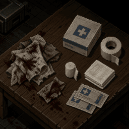
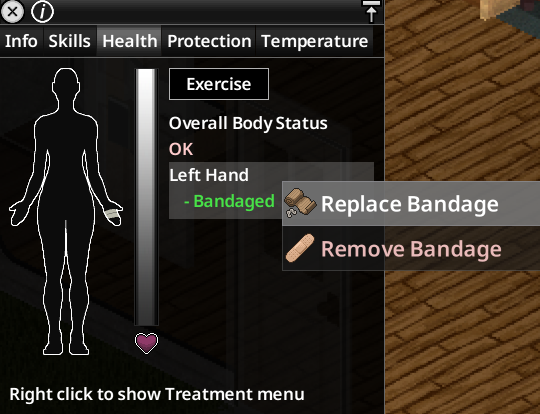
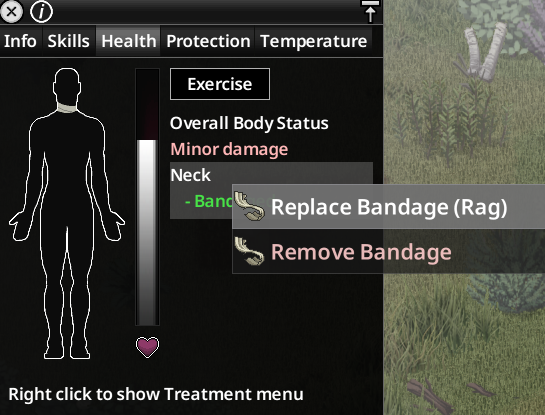
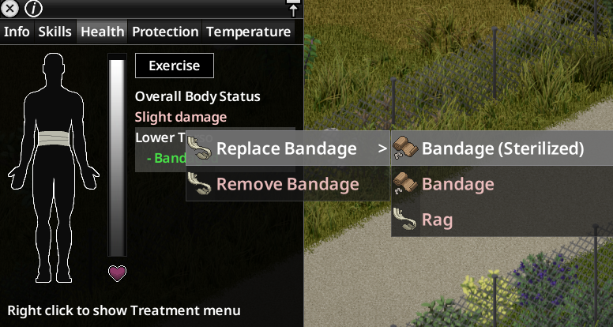
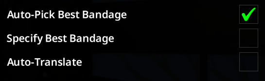

# ReBandaged

> *First-aid automation for those who are too lazy to even bleed out properly.*
> — **SilentSalo**

---

## Experience

This mod is very vanilla-friendly; it doesn't add anything extreme.

---

## Features

* **Replace Bandage**

---

## Sandbox

* **Auto-Pick Best Bandage**
  * If enabled, the mod will automatically select the best available bandage from the inventory (including containers) and use it.
  * If disabled, a submenu will appear for manual selection.

* **Specify Best Bandage**
  * If enabled, the mod will specify the best available bandage in the context menu (e.g. «Replace Bandage (Rag)»).
  * If disabled, the mod will not specify the best bandage in the context menu (e.g. «Replace Bandage»).
  * *Note*: both cases will always show the icon of the best bandage in the context menu.

* **Auto-Translate**
  * If enabled, the mod will automatically try to translate context actions to your local language using available in-game translations.
  * If disabled, the mod will use the translations that come in a package.
  * *Note*: might not work the best for all languages.

---

## Translations

The mod comes with an **Auto-Translate** sandbox setting, however, the option uses in-game text, so the translation can be somewhat wacky in some languages.

List of the translations that come in a packed with the mod:

* **EN** - by [SilentSalo](https://steamcommunity.com/id/SilentSalo/)
* **UA** - by [SilentSalo](https://steamcommunity.com/id/SilentSalo/)
* **RU** - by [SilentSalo](https://steamcommunity.com/id/SilentSalo/)

If you want to make a translation for **ReBandaged**, refer to this **[Thread](https://steamcommunity.com/workshop/filedetails/discussion/3783949266/84031737849649819/)**.

---

## Bugs

Found a bug? Submit in in this **[Thread](https://steamcommunity.com/workshop/filedetails/discussion/3783949266/84031737849649867/)**.

---

## Workshop

* **Workshop ID**: 3783949266
* **Mod ID**: ReBandaged